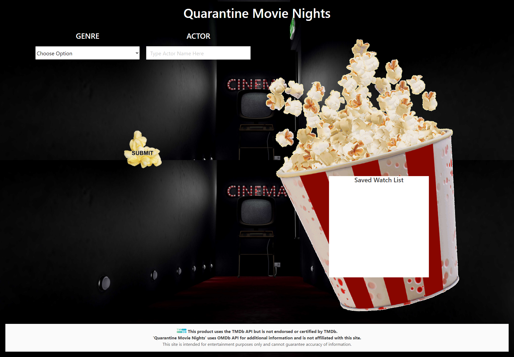

# Quarantine Movie Nights
 
## Purpose 
To assist a user in locating a streaming movie based on the genre and actor of choice. 
The app will also save a "Watch List" for any movies selected within the app. 
 - Backlog - next sprint - include a Streaming API so that a user can identify which streaming platform might host the saved movies.

## Webpage

https://joshcarter8400.github.io/Group-Project-1/

## Contributors
- Josh Carter
- Chris Southwick
- Rebecca Beall
- Gil Abadio

## GitHub Repos
https://github.com/JoshCarter8400/Group-Project-1 - Josh

## Tools used
HTML
CSS
Javascript
Local Storage
CSS Framework - Bulma
AJAX
APIS - TMDb & OMDb https://developers.themoviedb.org ; http://www.omdbapi.com/apikey.aspx
GitHub
Photoshop
